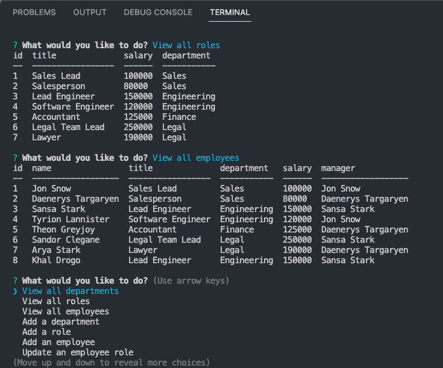

# Employee-Tracker

## Description

## Built With
* JavaScript
* Node.js
* Inquirer
* Mysql2
* Console.table

## Installation
1. Clone the Git repository and run as an integrated terminal.
2. run "npm install"
3. Start the application by running "node index"
4. Use arrow keys to select options.

## Usage

## Tests

## Mock-up

The following images show the web application's appearance and functionality:

## Demonstration
https://photos.app.goo.gl/MRjf4WV4ZR9FpuJ68